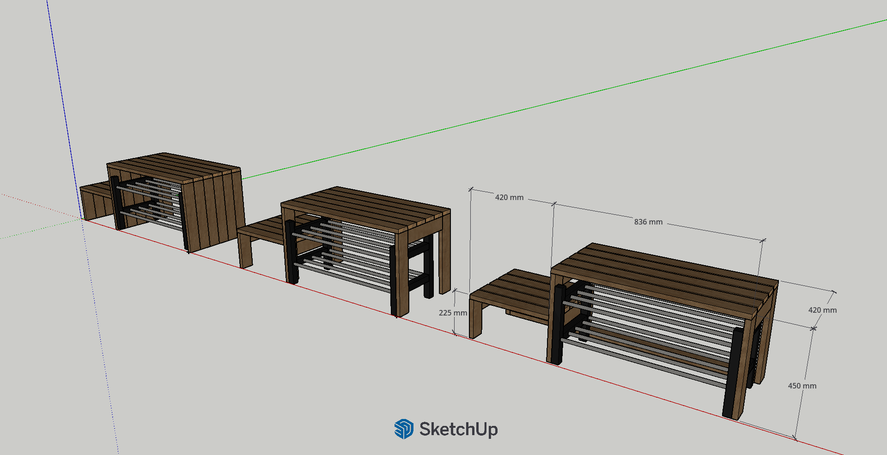
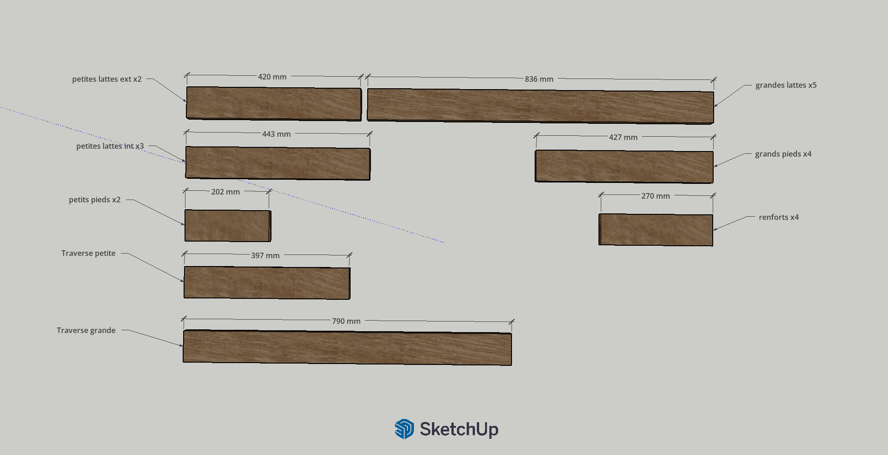
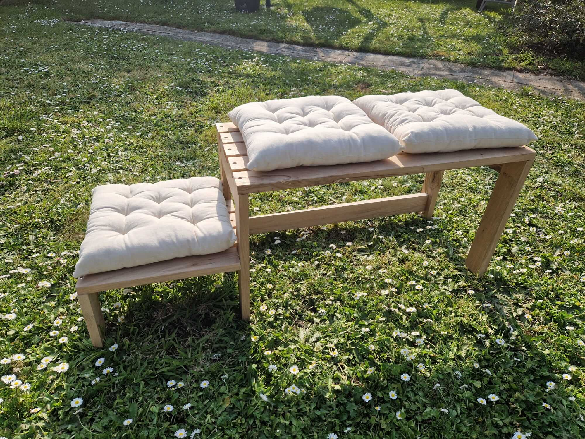

# {{ title }}

## Contexte / idée de départ

Ce projet est né d’un besoin simple : créer un espace pour s’asseoir afin de mettre ses chaussures tout en améliorant leur rangement dans l’entrée.

Plutôt que de repartir de zéro, j’ai choisi de réutiliser un meuble de rangement IKEA déjà présent, en construisant une structure autour afin d’y intégrer un banc.

Une deuxième contrainte est rapidement apparue : intégrer une partie plus basse pour permettre à un enfant de s’asseoir facilement et gagner en autonomie dans l’habillage.

## Conception & réflexion

Le projet a commencé par une modélisation sur SketchUp afin de définir précisément les dimensions et les proportions.

La conception s’appuie sur plusieurs références :

- les hauteurs standards de mobilier pour assurer un confort d’assise
- les dimensions des coussins, achetés en amont pour le projet
- les mesures du meuble de rangement existant

Le design reste volontairement simple et ajouré afin d’éviter un aspect trop massif dans l’entrée. L’objectif était de conserver une structure légère visuellement, tout en garantissant une solidité suffisante pour s’asseoir ou s’appuyer sans précaution particulière.

Pour la matière, j’ai choisi des planches de chêne récupérées dans une recyclerie, ce qui permettait d’utiliser un bois plus noble tout en restant dans une logique de réemploi.

## Réalisation

Une fois les plans validés, la fabrication a consisté à suivre les différentes étapes prévues : découpe des planches, préperçages et préparation des assemblages.

Certaines parties sont maintenues par tourillons, tandis que d’autres utilisent des vis apparentes. Initialement choisies par simplicité, ces vis apportent finalement un aspect plus assumé de meuble assemblé, plutôt que celui d’un simple assemblage de planches.

Un premier montage à blanc a permis de vérifier les alignements et les ajustements avant l’assemblage final.

L’ensemble forme un banc robuste, avec deux niveaux d’assise adaptés à différents usages.

## Ce que j’ai appris

Ce projet m’a rappelé l’importance de toujours prévoir un léger jeu lors de l’intégration d’un meuble dans un espace existant.

Le banc avait été conçu pour s’ajuster exactement au rangement IKEA, ce qui a rendu son installation plus compliquée que prévu une fois la structure assemblée. Un léger ponçage a permis de corriger rapidement le problème.

Ce type d’ajustement reste une bonne leçon : même avec un plan précis, il est préférable de garder une petite marge pour absorber les variations réelles du matériau et de l’environnement.

