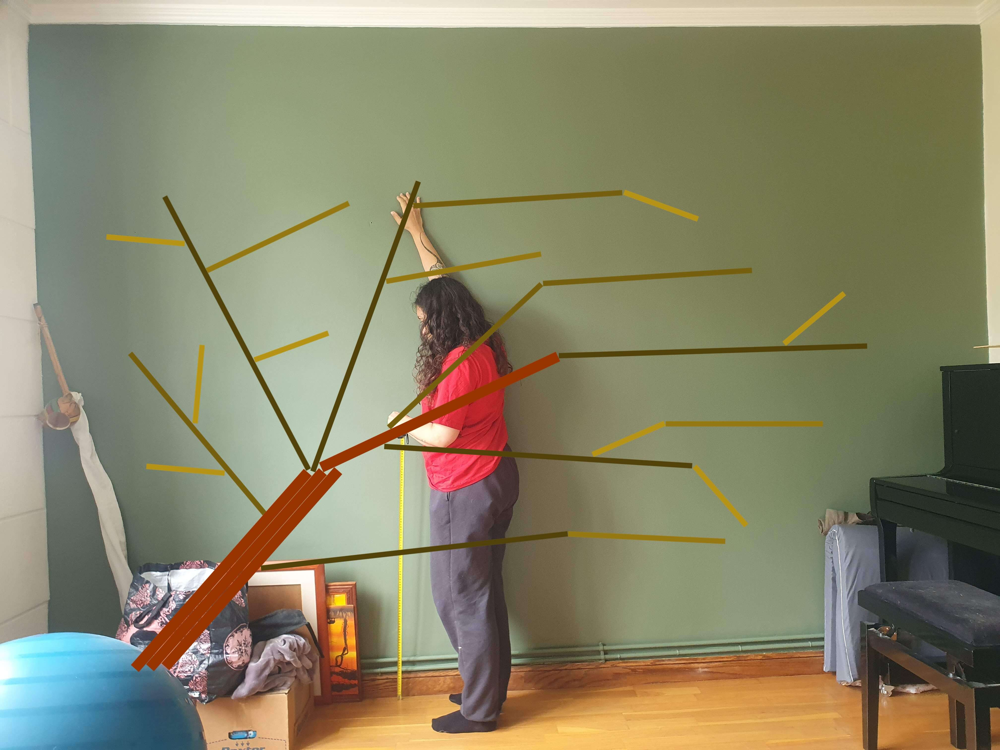
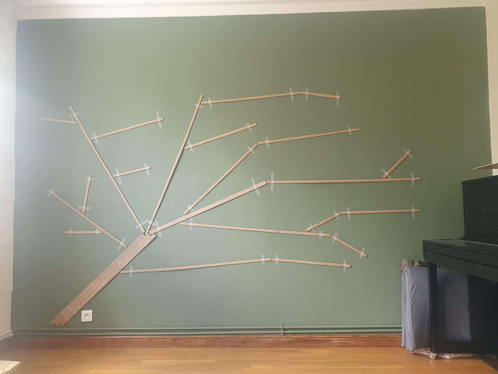
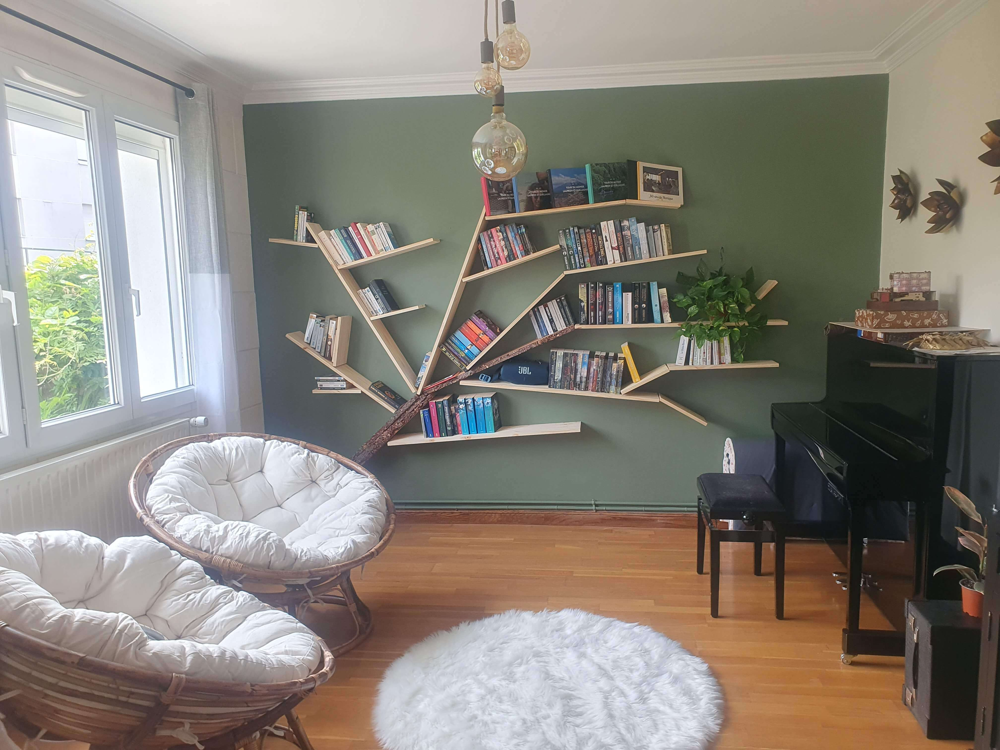

# {{ title }}

## Contexte / idée de départ

L’idée de ce projet est née d’une image envoyée par ma conjointe représentant une bibliothèque murale dont les étagères formaient les branches d’un arbre.

Même si l’image d’origine était manifestement générée par intelligence artificielle et peu réaliste dans sa construction, le principe visuel m’a semblé suffisamment intéressant pour tenter de le reproduire dans une version réellement réalisable.

Le défi était donc de transformer une inspiration purement visuelle en un agencement fonctionnel capable d’accueillir des livres tout en conservant l’illusion graphique de l’arbre.

## Conception & réflexion

Le projet s’est rapidement orienté vers l’utilisation d’étagères à fixation invisible de différentes longueurs. La disponibilité de ces éléments a d’ailleurs fortement influencé la conception, puisqu’il n’existe que quatre tailles différentes.

La première étape a consisté à réaliser un dessin en m’inspirant de la structure d’un véritable arbre. L’objectif était de positionner chaque étagère de manière crédible visuellement, tout en conservant une fonction pratique pour le rangement des livres.

Certaines étagères permettent de poser les livres à plat, tandis que d’autres servent de support latéral pour éviter qu’ils ne tombent. L’ensemble a donc été conçu à la fois comme un motif graphique et comme un système de rangement.

Pour renforcer l’effet de tronc, j’ai choisi d’utiliser une grande planche de pin à bord vivant, afin d’apporter un contraste plus organique avec les lignes droites des étagères.

## Réalisation

La réalisation a commencé par la préparation du tronc.

La planche de pin à bord vivant a été découpée en quatre sections puis lasurée, afin de créer visuellement un tronc en deux parties. Cette étape permet de structurer l’ensemble et de donner un point d’ancrage visuel au motif.

L’installation des étagères a constitué la partie la plus longue du projet. Au total, 22 étagères ont été posées, chacune nécessitant quatre points de fixation, soit 88 perçages et chevilles dans le mur.

Chaque élément a été positionné avec soin pour conserver la continuité du motif tout en limitant les espaces vides entre deux étagères.

Une fois les livres installés, quelques éléments décoratifs comme une plante et du lierre artificiel ont été ajoutés pour accentuer l’effet végétal et renforcer l’illusion de l’arbre.

## Ce que j’ai appris

Ce projet m’a surtout permis de travailler sur la dimension d’agencement et de composition.

Le travail du bois en lui-même reste relativement limité, mais la phase de conception et de pose demande une vraie réflexion sur les proportions, les alignements et l’équilibre visuel.

Transformer une idée esthétique en installation fonctionnelle implique de jongler entre contraintes techniques, dimensions disponibles et usage réel.

C’est un exercice très proche du travail d’agencement intérieur, où la précision de la planification et de la pose joue un rôle aussi important que la fabrication elle-même.

