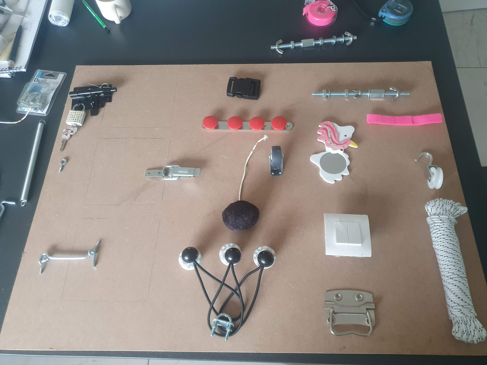
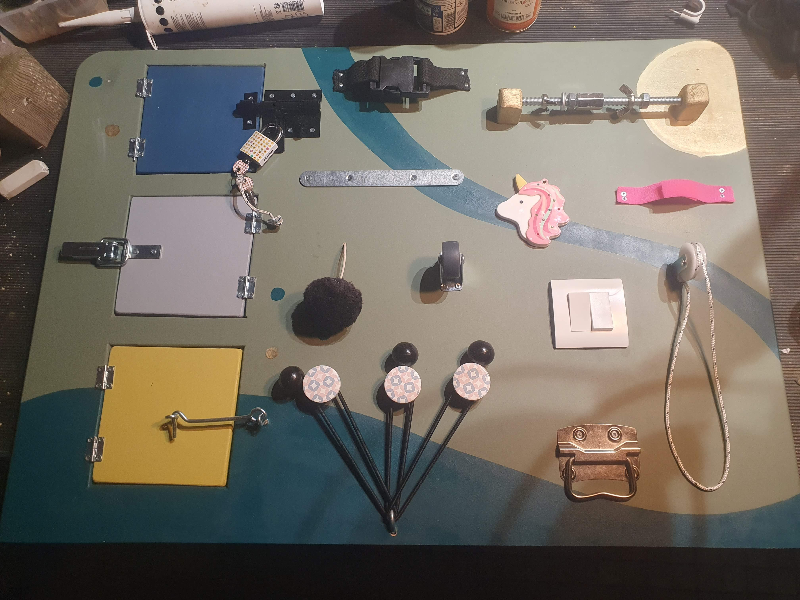

# {{ title }}

## Contexte / idée de départ

En cherchant un tableau d’activités pour enfant, j’ai été surpris par les prix pratiqués pour des modèles pourtant assez simples dans leur conception.

Plutôt que d’en acheter un directement, j’ai décidé de tenter d’en fabriquer un moi-même. L’objectif était double : proposer un objet adapté à l’enfant tout en explorant un projet mêlant bricolage, conception et réflexion sur l’usage.

L’idée était également de pouvoir personnaliser l’esthétique afin que l’objet s’intègre naturellement dans notre intérieur.

## Conception & réflexion

La première étape a consisté à identifier différents modules intéressants et réalisables avec les outils dont je disposais. Une fois cette sélection faite, je suis parti chercher les différents éléments en magasin.

Même en privilégiant les fins de stock et les produits d’entrée de gamme, le coût total des éléments nécessaires s’est finalement révélé assez proche d’un produit du commerce : environ 80 € pour la planche et les différents modules, contre une centaine d’euros pour un modèle équivalent en ligne.

L’intérêt du projet s’est donc déplacé vers l’aspect expérimental et personnalisé : choix des modules, organisation du tableau et adaptation des couleurs à l’environnement de la pièce.

Les peintures utilisées proviennent d’ailleurs des restes utilisés pour repeindre le salon, ce qui permet une intégration visuelle cohérente.

Une attention particulière a également été portée à la sécurité et au confort : tous les éléments ont été choisis ou positionnés pour être manipulables par un enfant dès environ 8 mois, tout en évitant les pièces dangereuses ou trop bruyantes.

## Réalisation

Le tableau est constitué d’une planche principale sur laquelle différents modules interactifs ont été fixés.

Parmi les éléments installés :

- des petits volets à ouvrir et fermer
- une roue de caddie
- une barre magnétique
- un système de poulie
- différents éléments manipulables

Chaque module a été positionné de manière à laisser suffisamment d’espace pour la manipulation tout en conservant une composition équilibrée.

L’ensemble reste simple dans sa construction, mais demande une certaine attention dans le choix et l’agencement des éléments pour maintenir un ensemble cohérent et sécurisé.

## Ce que j’ai appris

Ce projet a surtout été intéressant en termes d’observation de l’usage réel.

Certains modules se sont révélés beaucoup plus attractifs que d’autres. Les trois volets et la roue de caddie sont clairement les éléments les plus appréciés, tandis que la barre magnétique fonctionne moins bien en raison de la faible puissance des aimants adaptés aux enfants.

La poulie, quant à elle, a tendance à coincer légèrement, ce qui limite son utilisation.

Ces retours d’usage sont précieux, car ils permettent de mieux comprendre ce qui attire réellement l’attention d’un enfant et ce qui mérite d’être amélioré.

Même si l’économie réalisée est finalement limitée, ce projet reste un exercice très formateur, combinant conception, fabrication et observation du comportement utilisateur.

