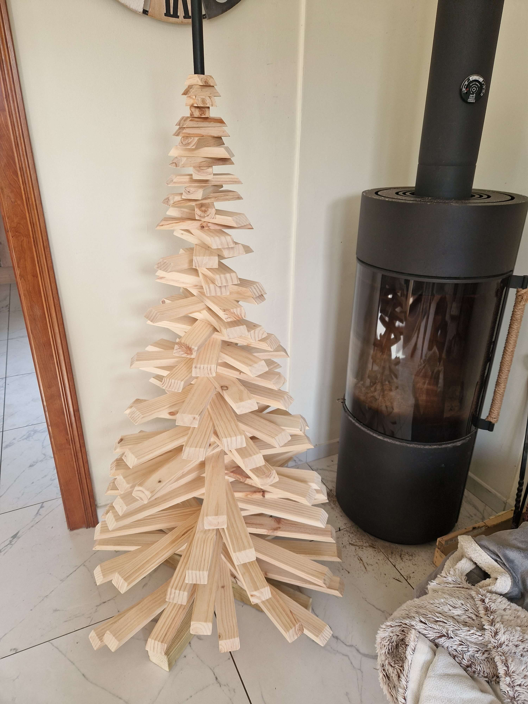
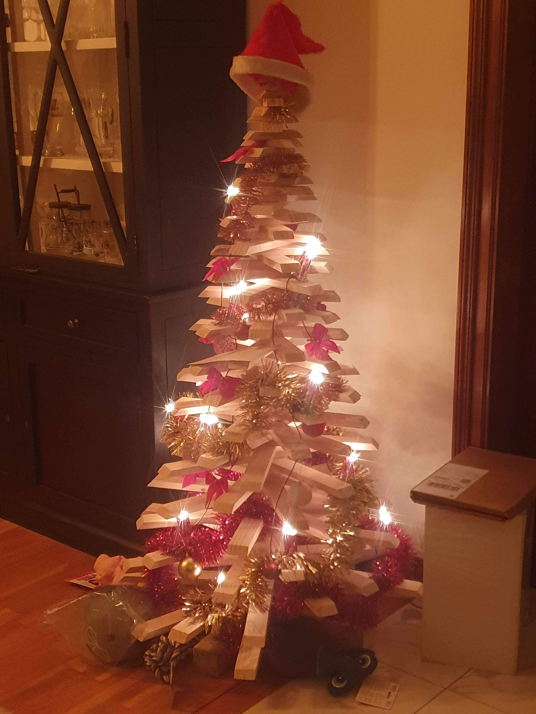

# {{ title }}

## Contexte / idée de départ

L’objectif était de proposer une alternative au sapin de Noël traditionnel : une version réutilisable, plus épurée visuellement, et sans les inconvénients classiques (entretien, épines, encombrement après les fêtes).

L’idée s’inscrit dans une démarche à la fois pratique et esthétique, avec la volonté de créer un objet décoratif moderne, capable de s’intégrer facilement dans un intérieur.

Le concept n’est pas inédit, mais c’est une vidéo YouTube qui a servi de déclencheur pour passer à la réalisation.

## Conception & réflexion

Le principe repose sur un empilement de tasseaux de longueurs croissantes, formant une silhouette pyramidale évoquant un sapin.

La structure est maintenue par une tringle centrale, récupérée d’un ancien support de rideau, fixée verticalement dans un pied pour assurer la stabilité de l’ensemble.

La conception a commencé par la définition des proportions :

- une hauteur cible de 150 cm
- une largeur déterminée à partir d’un ratio pour conserver une forme équilibrée

Une attention particulière a été portée à la répartition des longueurs de tasseaux, afin d’optimiser les découpes et limiter les chutes.

## Réalisation

La réalisation demande surtout de la régularité et de la précision dans la découpe des tasseaux.

Chaque élément est découpé à la bonne longueur, puis enfilé successivement sur la tringle centrale, ce qui permet de construire progressivement la forme du sapin.

Le montage reste simple dans son principe, mais relativement long en raison du nombre de pièces à préparer.

Une fois assemblé, l’ensemble est stable et lisible, avec une silhouette nette et homogène.

## Ce que j’ai appris

Ce projet m’a permis de travailler sur la gestion des proportions et l’optimisation des découpes.

La phase de préparation, notamment le calcul et la répartition des longueurs, a eu un impact direct sur le rendu final, mais aussi sur la quantité de matière utilisée.

Cela m’a amené à anticiper davantage en amont, en cherchant un équilibre entre esthétique, cohérence des dimensions et limitation des pertes.

C’est un projet où la simplicité apparente repose en réalité sur une bonne préparation.

