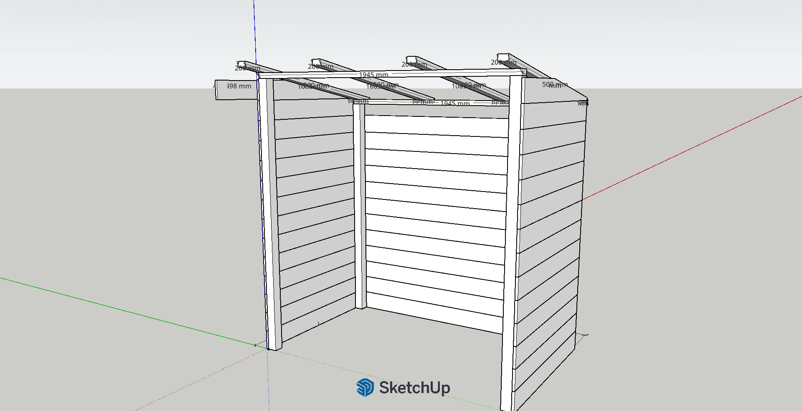
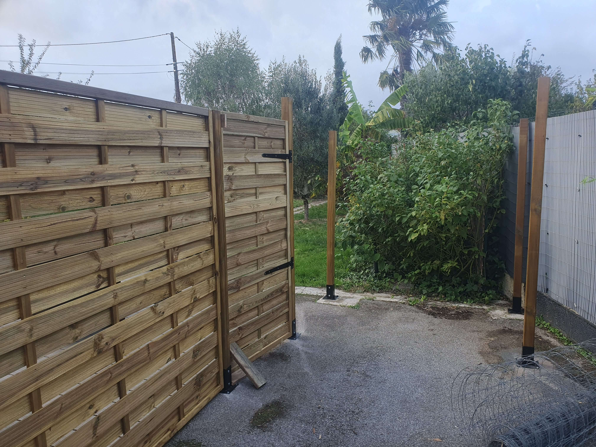
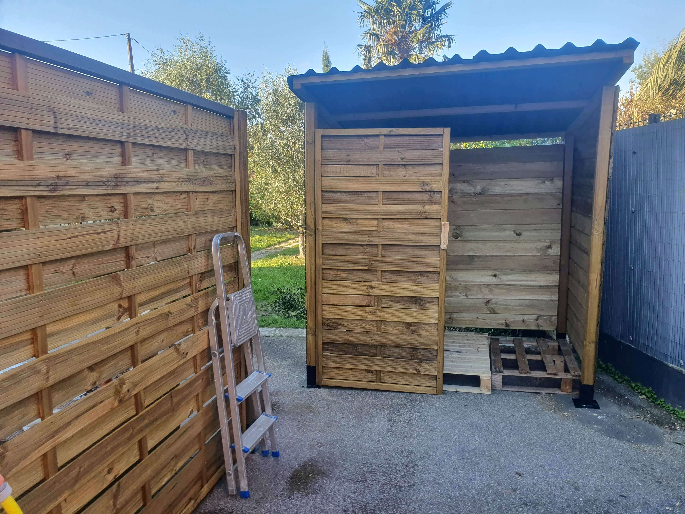

# {{ title }}

## Contexte / idée de départ

Ce projet est né d’un double besoin assez simple mais structurant pour l’aménagement du jardin : créer une délimitation plus nette de l’espace tout en intégrant un abri fonctionnel pour le stockage du bois de chauffage, à proximité immédiate d’un accès extérieur.

L’objectif était donc de concevoir une structure qui ne soit pas uniquement utilitaire, mais qui participe aussi à l’organisation visuelle du jardin, en jouant sur les volumes et les ouvertures.

## Conception & réflexion

Le projet a commencé par une prise de mesures sur site, suivie d’une première modélisation rapide sur SketchUp pour poser les grandes lignes.

Deux itérations supplémentaires ont été nécessaires :

- une pour valider la faisabilité technique et affiner les sections de bois
- une dernière pour figer les matériaux et anticiper précisément les découpes

La structure repose sur 6 poteaux montés sur pieds, avec une organisation en trois zones :

- un claustra fixe pour structurer visuellement l’espace
- un demi-claustra monté sur gond, servant de porte
- une zone fermée en bardage pour le stockage du bois

Le choix s’est porté sur du pin, matériau courant en extérieur, avec une mise en œuvre volontairement simple, le projet ne nécessitant pas une précision millimétrique.

## Réalisation

Le montage s’est déroulé sur environ trois jours.

La première étape a consisté à poser et aligner les poteaux, qui structurent entièrement l’ensemble. Une fois cette base en place, le claustra a été réalisé, suivi de sa version mobile montée sur gond pour créer une ouverture.

La partie abri a ensuite été fermée à l’aide de bardage, fixé entre les quatre poteaux restants. Enfin, un toit en plaques ondulées a été installé, reposant sur des chevrons ajoutés en renfort.

L’ensemble du projet a été réalisé avec des matériaux standards de bricolage extérieur, dans une logique d’efficacité et de robustesse.

## Ce que j’ai appris

Ce projet a surtout été riche en enseignements sur le comportement du bois en extérieur.

Le bardage, initialement posé de manière trop serrée et avec une fixation insuffisante, a travaillé avec l’humidité et s’est partiellement décroché. Cela m’a amené à revoir la manière de poser les lames, en intégrant davantage de jeu et en renforçant les fixations.

De la même manière, une des sections de mur s’est révélée trop longue sans renforts intermédiaires, ce qui a nécessité l’ajout d’une traverse après coup pour rigidifier l’ensemble.

Ces ajustements m’ont permis de mieux anticiper les contraintes mécaniques et les variations dimensionnelles du bois, en particulier sur des structures extérieures exposées.

